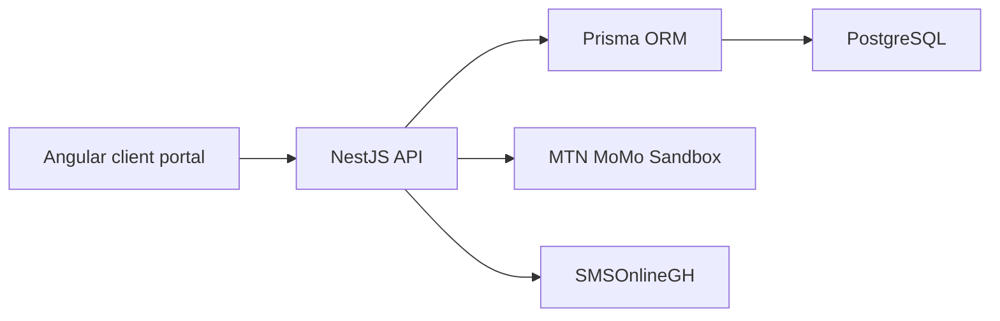

# SMS Portal MVP Architecture

## Product Boundary

The MVP is a pay-as-you-go Bulk SMS platform. It does not include monthly SaaS subscriptions, recurring billing, coupons, discounts, partial payments, credit sales, refund automation, multiple SMS providers, multiple payment providers, or white-label domains.

## Runtime Flow

Angular never calls MTN MoMo or SMSOnlineGH directly. Provider credentials stay in the backend.

## Payment Flow

1. Client selects an active `SmsPackage`.
2. Backend snapshots `amountGhs` and `smsUnits` into `Payment`.
3. Backend creates an MTN MoMo request-to-pay using `providerReference`.
4. Callback or polling updates the `Payment.status`.
5. A successful payment credits the wallet through `WalletService.creditFromPayment`.
6. Wallet crediting uses `idempotencyKey = payment:{paymentId}` and `Payment.creditedAt`.

Payment buys wallet credits. Wallet credits buy SMS.

## Wallet Flow

Wallet transactions are append-only ledger records:

- `CREDIT / PAYMENT` for verified payments.
- `CREDIT / MANUAL_TOP_UP` for admin top-ups.
- `DEBIT / CAMPAIGN` for SMS campaigns.

Each operation records `balanceBefore`, `balanceAfter`, `units`, `source`, and an idempotency key.

## Campaign Flow

1. Client creates a campaign with a sender ID, message, and recipients or contact groups.
2. Backend resolves recipients and calculates SMS units.
3. Backend debits the client wallet in a database transaction.
4. Backend sends messages through the SMS provider abstraction.
5. Campaign recipients store delivery state and provider IDs.

## Multi-Client Shape

Client-owned tables include `clientId`:

- Users
- Wallet accounts and transactions
- Payments
- Sender IDs
- Contacts and groups
- Message templates
- Campaigns
- Audit logs

Super admin endpoints live under `/api/admin/*`; client endpoints scope data from the authenticated user's `clientId`.

## Provider Placeholders

`MtnMomoProvider` and `SmsOnlineGhProvider` are backend-only adapters. They currently run in mock/placeholder mode when credentials are missing, so the rest of the MVP can be developed without leaking secrets into the frontend.
